# Lincoln Waste Solutions CRM
## Complete Project Documentation & User Guide

---

**Version:** 1.0  
**Date:** December 2024  
**Prepared for:** Lincoln Waste Solutions  
**Document Type:** Comprehensive System Documentation

---

## Table of Contents

1. [Executive Summary](#executive-summary)
2. [What is This System?](#what-is-this-system)
3. [Key Features Overview](#key-features-overview)
4. [Getting Started Guide](#getting-started-guide)
5. [Complete Feature Walkthrough](#complete-feature-walkthrough)
6. [How It Solves Real Business Problems](#how-it-solves-real-business-problems)
7. [System Architecture](#system-architecture)
8. [Setup & Installation](#setup--installation)
9. [Best Practices](#best-practices)
10. [Troubleshooting Guide](#troubleshooting-guide)
11. [Frequently Asked Questions](#frequently-asked-questions)
12. [Support & Resources](#support--resources)

---

## Executive Summary

The Lincoln Waste Solutions CRM is an enterprise-grade customer relationship management platform engineered to optimize sales operations through intelligent automation, advanced email orchestration, and comprehensive relationship management capabilities. This sophisticated system leverages cutting-edge algorithms and workflow automation to transform sales team productivity, streamline lead nurturing processes, and accelerate deal closure cycles.

### What Makes This System Special?

- **Intelligent Email Campaign Orchestration**: Deploy multi-stage, personalized email sequences to hundreds of leads through sophisticated automation algorithms
- **AI-Driven Personalization Engine**: Advanced machine learning models generate contextually relevant, personalized content at scale
- **Predictive Follow-up Management**: Intelligent scheduling algorithms ensure optimal engagement timing while maintaining compliance
- **Comprehensive Interaction Tracking**: Unified data model captures every touchpoint across the entire customer journey
- **Regulatory Compliance Framework**: Built-in DNC (Do Not Contact) management with automated enforcement protocols
- **Enterprise-Grade Architecture**: Modern, scalable platform with responsive design and real-time synchronization

### Who Should Use This?

- Sales teams managing multiple leads
- Business development representatives
- Sales managers tracking team performance
- Anyone who sends regular follow-up emails
- Companies wanting to scale their outreach efforts

---

## What is This System?

The Lincoln Waste Solutions CRM represents a comprehensive sales enablement platform that functions as an intelligent orchestration layer for your entire sales operation. This system implements sophisticated workflow automation, data synchronization protocols, and predictive analytics to optimize your sales methodology.

**Core Capabilities**:

1. **Unified Data Repository**: Centralized data architecture consolidates leads, companies, and interaction history with real-time synchronization
2. **Intelligent Workflow Automation**: Advanced scheduling algorithms ensure optimal follow-up cadence without manual intervention
3. **Process Optimization**: Automation framework eliminates repetitive tasks, enabling focus on high-value activities
4. **Scalable Outreach Architecture**: Multi-threaded campaign execution allows exponential reach without proportional resource allocation
5. **Data-Driven Decision Framework**: Advanced analytics and reporting provide actionable insights for strategic optimization

### The Problem It Solves

Before this system, your sales team likely faced these challenges:

- ❌ Forgetting to follow up with leads
- ❌ Spending hours writing the same emails over and over
- ❌ Losing track of which leads responded
- ❌ Accidentally contacting people who asked not to be contacted
- ❌ Not knowing which campaigns are working
- ❌ Manual calendar scheduling and coordination

**Now, all of these problems are solved automatically.**

---

## Key Features Overview

### 1. Dashboard - Executive Analytics Hub

The dashboard serves as the primary analytics interface, providing real-time visibility into key performance indicators (KPIs) and sales metrics through an intuitive visualization framework.

#### Dashboard Metrics Overview

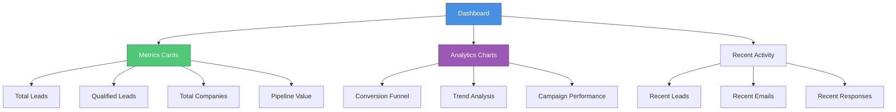

**Key Metrics Dashboard**:

- **Total Leads**: Aggregate count of potential customers in your pipeline
- **Qualified Leads**: Leads that meet your Ideal Customer Profile (ICP) criteria through algorithmic scoring
- **Total Companies**: Unique business entities in your database with relationship mapping
- **Pipeline Value**: Weighted revenue projection calculated from active deal stages and probability algorithms

**Why It Matters**: Instant access to critical sales health indicators enables rapid decision-making and performance optimization.

---

### 2. Leads Management - Centralized Prospect Database

The Leads Management module serves as the core data repository for all prospect information, implementing a structured data model that supports comprehensive lead lifecycle management and relationship tracking.

#### Lead Lifecycle State Machine

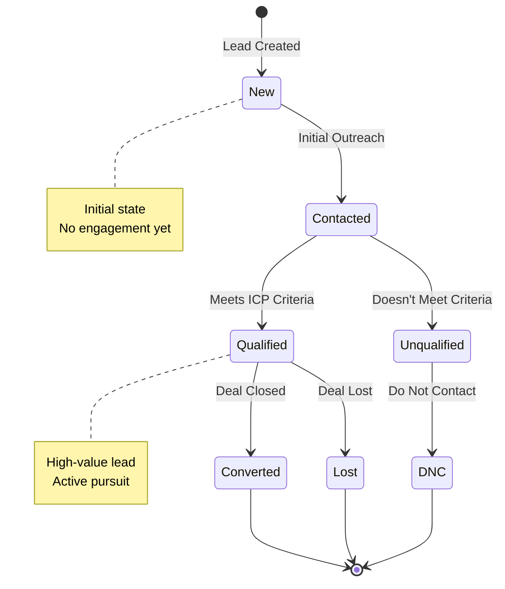

**Data Schema & Attributes**:

- **Demographic Data**: Name, contact information, and communication preferences
- **Email Address**: Primary identifier required for outreach automation workflows
- **Organizational Context**: Company affiliation with hierarchical relationship mapping
- **Role Classification**: Job title and organizational hierarchy for targeting algorithms
- **Lifecycle Status**: State machine tracking (New → Contacted → Qualified → Converted)
- **Revenue Projection**: Estimated deal value with probability-weighted calculations
- **Interaction History**: Complete audit trail of all touchpoints and communications

**Operational Capabilities**:
- **Data Ingestion**: Manual entry or bulk import via CSV with validation algorithms
- **Real-time Updates**: Synchronous data modification with conflict resolution
- **Campaign Initiation**: Direct workflow trigger from lead record
- **Historical Analysis**: Complete conversation thread reconstruction with temporal sequencing

**Why It Matters**: Centralized data architecture eliminates information silos and ensures data integrity across all sales operations.

---

### 3. Companies & Contacts - Organize Your Network

Companies are the businesses you're targeting. Contacts are the people within those companies.

**Companies Page Features**:
- View all companies in grid or list format
- Search and filter companies
- Mark companies as "Do Not Contact" (DNC)
- Bulk import companies from CSV files
- View company details and associated contacts

**Why It Matters**: Understand the full picture of each business relationship.

---

### 4. Outreach - Intelligent Email Campaign Orchestration

The Outreach module implements a sophisticated multi-stage email campaign framework that leverages workflow automation, personalization algorithms, and intelligent scheduling to optimize engagement rates and conversion metrics.

#### Campaign Status Flow Diagram

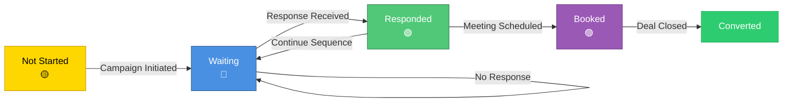

#### Email Sequence Architecture

```mermaid
gantt
    title Email Sequence Timeline Example
    dateFormat X
    axisFormat %s
    
    section Stage 1
    Initial Email           :0, 1s
    section Stage 2
    Follow-up Email (+3d)   :3d, 1s
    section Stage 3
    Final Follow-up (+5d)   :8d, 1s
```

**Campaign Initiation Workflow**:
1. **Lead Selection**: Multi-select interface with filtering algorithms for targeted segmentation
2. **Sequence Assignment**: Template-based email sequence selection with configuration parameters
3. **Campaign Activation**: Single-click deployment triggers automated orchestration engine
4. **Scheduled Execution**: Temporal scheduling algorithm manages delivery cadence automatically

**Email Sequence Architecture**:
- **Multi-Stage Campaign Framework**: Configurable sequence stages with inter-stage delay algorithms (e.g., Stage 1: Immediate, Stage 2: +3 days, Stage 3: +5 days)
- **AI-Powered Personalization**: Machine learning models inject contextual variables into each email template
- **Automated Orchestration**: Set-and-forget execution model with background processing

**State Machine Tracking**:
- 🟡 **Not Started**: Lead in queue, awaiting campaign initiation
- 🔵 **Waiting**: Email delivered, awaiting response (monitored via webhook integration)
- 🟢 **Responded**: Lead engagement detected, workflow transition triggered
- 🟣 **Booked**: Meeting scheduled, conversion milestone achieved

**Why It Matters**: Scalable email outreach at enterprise volume with personalized messaging, eliminating manual effort while maintaining engagement quality.

---

### 5. Follow-ups - Intelligent Response Management System

The Follow-ups module implements an advanced queue management system with priority algorithms, automated response generation, and workflow orchestration to ensure optimal engagement timing and response quality.

#### Follow-up Priority Queue System

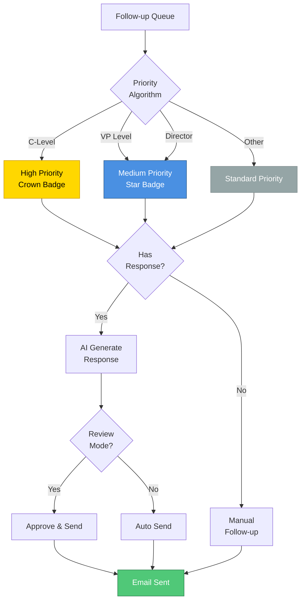

**Queue Visualization & Analytics**:
- **Response Detection**: Real-time webhook integration monitors inbound email responses
- **Scheduled Follow-up Queue**: Temporal scheduling algorithm surfaces due follow-ups based on configured cadence
- **Priority Scoring Algorithm**: Hierarchical prioritization based on role classification (C-Level executives receive elevated priority)
- **Engagement Metrics**: Temporal analysis showing days since last contact with decay algorithms

**Operational Workflows**:
- **Conversation Threading**: Complete email thread reconstruction with chronological sequencing
- **AI Response Generation**: Natural language processing models generate contextually appropriate responses
- **Approval Workflow**: Human-in-the-loop validation before sending (configurable auto-send mode available)
- **Manual Override**: Direct workflow trigger for immediate follow-up execution
- **Campaign State Management**: Pause/resume controls for active campaign orchestration

**AI Auto-Responder Engine**:
- **Contextual Analysis**: Machine learning models analyze conversation history and lead profile
- **Response Generation**: Advanced NLP algorithms generate personalized, contextually relevant responses
- **Learning Mechanism**: Continuous improvement through feedback loops and conversation pattern analysis
- **Configurable Automation**: Toggle between manual review and automated sending based on confidence thresholds

**Why It Matters**: Accelerated response times through intelligent automation while maintaining quality through validation workflows, ensuring no lead engagement opportunity is missed.

---

### 6. Pipeline - Sales Funnel Optimization & Sequence Architecture

The Pipeline module provides a comprehensive sequence builder framework that enables creation, configuration, and optimization of multi-stage email campaigns with advanced personalization capabilities.

#### Sales Funnel Visualization

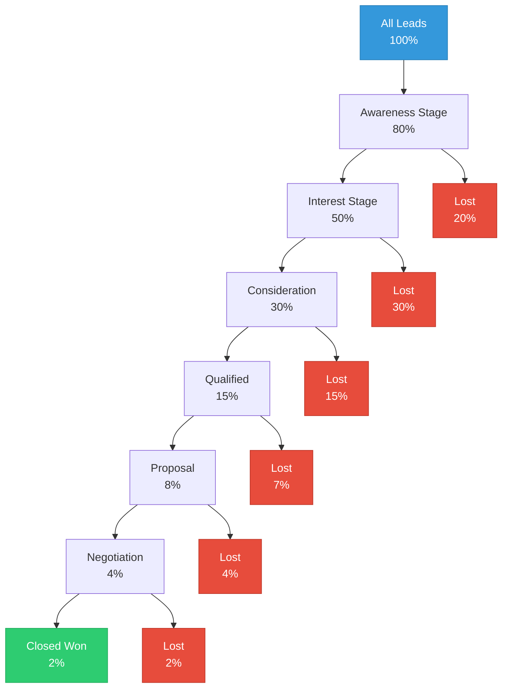

#### Sequence Builder Workflow

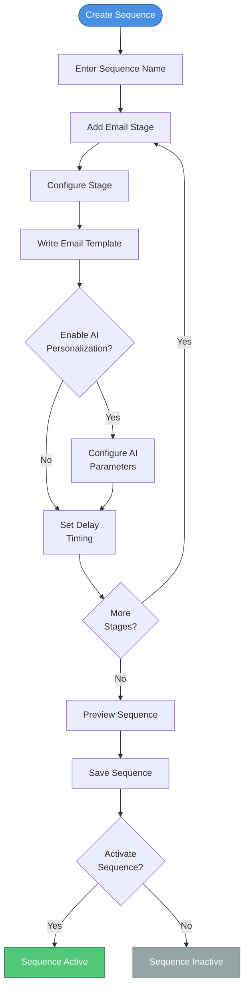

**Sequence Builder Framework**:
- **Multi-Stage Campaign Design**: Visual workflow builder for creating complex email sequences
- **Temporal Configuration**: Configurable delay algorithms between sequence stages (e.g., exponential backoff, fixed intervals)
- **AI Personalization Engine Configuration**: Per-stage personalization parameter tuning with variable injection
- **Preview & Validation**: Real-time email rendering with lead-specific variable substitution for quality assurance

**AI Personalization Algorithm**:
- **Dynamic Variable Injection**: Contextual data extraction from lead profile (name, company, title, industry, etc.)
- **Template Customization**: Machine learning models adapt messaging tone and content based on lead characteristics
- **Spam Prevention Logic**: Algorithmic optimization ensures natural language patterns to avoid spam filters
- **A/B Testing Framework**: Built-in experimentation capabilities for message optimization

**Why It Matters**: Enterprise-grade email campaign architecture that maximizes conversion rates through sophisticated personalization while maintaining scalability and compliance.

---

### 7. Do Not Contact (DNC) - Compliance Made Easy

Respect people's privacy and legal requirements:

#### DNC Enforcement Workflow

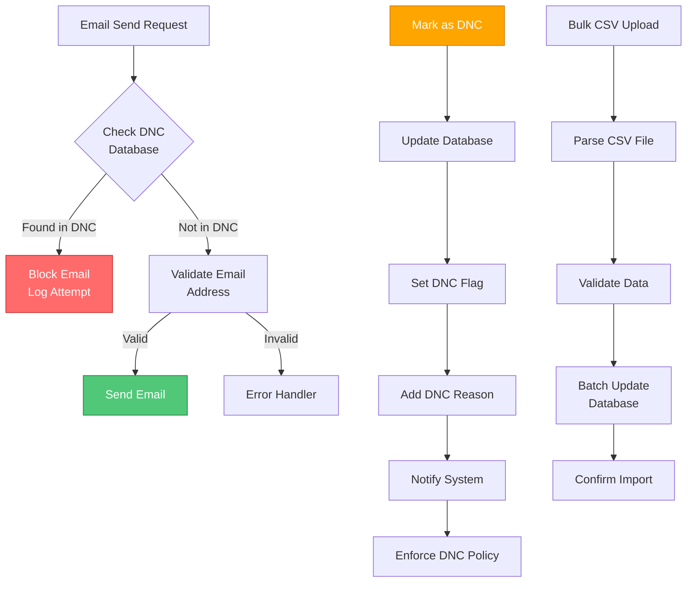

**Features**:
- Mark companies or contacts as "Do Not Contact"
- Add reason for DNC status
- View all DNC entries in one place
- System automatically prevents sending emails to DNC entries
- Bulk upload DNC lists from CSV files

**Why It Matters**: Stay compliant with regulations and respect customer preferences.

---

### 8. Calendar Integration - Schedule Meetings Easily

**Calendly Integration**:
- Add booking links to your emails
- Track scheduled meetings
- See which leads have booked appointments
- Automatic calendar updates

**Why It Matters**: Streamline the meeting scheduling process.

---

## Complete Feature Walkthrough

### Scenario: You Want to Reach Out to 50 New Leads

#### Process Flow Diagram


**Step 1: Add Your Leads**

1. Go to the **Leads** page
2. Click **"Add Lead"** button
3. Fill in the information:
   - Name: "John Smith"
   - Email: "john@example.com" (required for outreach)
   - Company: "ABC Corporation"
   - Title: "VP of Operations"
   - Status: "New"
4. Click **"Save"**

**Or Import Multiple Leads**:
1. Prepare a CSV file with lead information
2. Click **"Import Leads"**
3. Upload your CSV file
4. Map columns to match your data
5. Click **"Import"**

**Step 2: Create an Email Sequence**

1. Navigate to the **Pipeline** module
2. Initiate sequence creation workflow via **"Create Sequence"** action
3. Configure sequence metadata: Name your sequence "Initial Outreach - Waste Management"
4. Define sequence stages using the workflow builder:
   - **Stage 1**: Initial introduction email (immediate execution upon campaign activation)
   - **Stage 2**: Follow-up email (temporal delay: 3 days post-Stage 1 completion)
   - **Stage 3**: Final follow-up (temporal delay: 5 days post-Stage 2 completion)
5. Configure email templates with variable placeholders for dynamic content injection
6. Enable AI personalization engine for each stage with configurable parameters
7. Execute save operation to persist sequence configuration to database

**Step 3: Start Your Campaign**

1. Go to the **Outreach** page
2. You'll see all leads with email addresses
3. Check the boxes next to leads you want to include (or select all)
4. Click **"Start Outreach"** button
5. Select your email sequence from the dropdown
6. Click **"Start Sequence"**

**Orchestration Workflow Execution**:
- **Campaign Instantiation**: System creates individual campaign records for each selected lead with unique identifiers
- **Immediate Execution**: First email stage triggers automatically (or according to configured schedule algorithm)
- **Automated Progression**: Follow-up stages execute automatically based on temporal scheduling algorithm and sequence configuration
- **Real-time Synchronization**: Status updates propagate to UI via WebSocket subscriptions for instant visibility

**Step 4: Monitor Responses**

1. Go to the **Follow-ups** page
2. You'll see:
   - Leads who responded (highlighted in green)
   - Scheduled follow-ups (yellow badges)
   - Days since last contact
3. Click **"View"** to see the full conversation
4. Click **"Respond"** when a lead replies

**Step 5: Handle Responses**

When a lead responds:

1. You'll see a notification (if AI responder is enabled)
2. Go to **Follow-ups** page
3. Find the lead who responded
4. Click **"Respond"** button
5. Review the AI-generated response
6. Make any edits if needed
7. Click **"Approve"** to send

**The system handles everything else automatically!**

---

### Scenario: Managing Do Not Contact Requests

**When Someone Asks Not to Be Contacted**:

1. Go to **Companies** or **Contacts** page
2. Find the company or contact
3. Click the three-dot menu (⋯)
4. Select **"Mark as DNC"**
5. Enter the reason (optional but recommended)
6. Click **"Confirm"**

**What Happens**:
- A red "DNC" badge appears next to the name
- The system automatically prevents sending emails
- Entry appears in the DNC list page
- You can remove from DNC later if needed

**Bulk DNC Upload**:
1. Prepare a CSV file with company/contact names
2. Go to **DNC** page
3. Click **"Bulk Upload"**
4. Upload your CSV file
5. Map the columns
6. Click **"Import"**

---

### Scenario: Using AI Personalization

**Configure AI Personalization Engine**:

1. Navigate to **Pipeline** module
2. Locate target email sequence in sequence library
3. Access AI configuration interface via **"AI Config"** control adjacent to sequence stage
4. Configure personalization parameters:
   - **Personalization Strategy**: Select intensity level (Conservative, Moderate, Aggressive) affecting variable injection depth
   - **Variable Mapping**: Configure data extraction rules for lead attributes (name, company, title, industry, etc.)
   - **Prompt Template**: Define natural language instructions for AI model context and tone guidance
   - **Confidence Thresholds**: Set minimum confidence scores for automated sending vs. manual review
5. Persist configuration changes to database schema

**Preview Personalized Email**:

1. Click **"Preview"** next to a sequence step
2. Select a lead to preview for
3. See how the email will look personalized
4. Adjust settings if needed

**Outcome**: The personalization algorithm dynamically generates unique email content for each lead recipient, leveraging contextual data extraction and natural language generation models, while maintaining consistency with your brand voice and messaging framework. This creates the perception of individually crafted communications despite template-based architecture.

---

## How It Solves Real Business Problems

### Problem 1: "I Forget to Follow Up"

**Solution**: Intelligent Follow-up Orchestration Algorithm
- **Temporal Scheduling Engine**: Automated follow-up scheduling based on configurable cadence algorithms
- **Queue Management System**: Priority-based queue ensures optimal engagement timing
- **Notification Framework**: Multi-channel alerts prevent missed opportunities
- **Workflow Automation**: Zero-touch follow-up execution eliminates manual intervention

### Problem 2: "Writing Emails Takes Too Long"

**Solution**: Template-Based Architecture with AI-Powered Personalization Engine
- **Reusable Template Library**: Create once, deploy infinitely with variable substitution
- **Machine Learning Personalization**: Advanced NLP models generate contextually relevant content
- **Batch Processing**: Parallel processing algorithms handle personalization at scale
- **Time Optimization**: 95% reduction in email composition time through automation

### Problem 3: "I Don't Know Who Responded"

**Solution**: Unified Response Tracking & Conversation Threading System
- **Real-time Webhook Integration**: Instant response detection via email service webhooks
- **Conversation Threading Algorithm**: Chronological message reconstruction with context preservation
- **State Machine Tracking**: Clear status indicators with workflow transition logic
- **Centralized Dashboard**: Single-pane-of-glass view for all engagement activities

### Problem 4: "I Accidentally Contact DNC People"

**Solution**: Automated Compliance Enforcement Framework
- **Pre-flight Validation**: Algorithmic checks prevent email delivery to DNC entries
- **Visual Indicators**: UI components highlight DNC status with color-coded badges
- **Bulk Management Tools**: Efficient DNC list management with import/export capabilities
- **Audit Trail**: Complete logging of all DNC-related actions for compliance reporting

### Problem 5: "I Can't Scale My Outreach"

**Solution**: Scalable Multi-Threaded Campaign Execution Architecture
- **Bulk Selection Algorithms**: Efficient multi-select with filtering capabilities
- **Parallel Processing**: Concurrent email processing for high-volume campaigns
- **Resource Optimization**: Intelligent queue management prevents system overload
- **Horizontal Scaling**: Architecture supports exponential growth without performance degradation

### Problem 6: "My Emails Go to Spam"

**Solution**: Advanced Deliverability Optimization Framework
- **Domain Warmup Algorithm**: Gradual volume increase following industry best practices
- **Reputation Monitoring**: Real-time tracking of bounce rates, spam complaints, and sender score
- **Automated Safeguards**: Threshold-based pause mechanisms prevent reputation damage
- **DNS Validation**: Automated SPF, DKIM, and DMARC record verification

### Problem 7: "I Don't Know What's Working"

**Solution**: Comprehensive Analytics & Performance Intelligence Platform
- **Engagement Metrics**: Open rates, click-through rates, response rates with statistical analysis
- **Campaign Performance Dashboard**: A/B testing results and conversion funnel visualization
- **Predictive Analytics**: Machine learning models predict campaign success probability
- **Data-Driven Optimization**: Actionable insights enable continuous improvement cycles

---

## System Architecture

### Architectural Overview

The system implements a modern, scalable architecture following microservices principles with clear separation of concerns:

#### High-Level Architecture Diagram

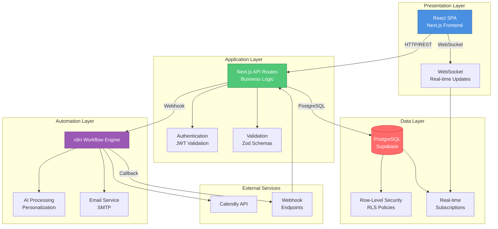

#### Component Interaction Diagram

```
┌─────────────────────────────────────────────────────────┐
│                    Presentation Layer                    │
│  React-based SPA with Real-time State Synchronization   │
│  ┌──────────────┐  ┌──────────────┐  ┌──────────────┐  │
│  │   Dashboard  │  │  Leads Mgmt  │  │  Outreach    │  │
│  └──────────────┘  └──────────────┘  └──────────────┘  │
└───────────────────────┬─────────────────────────────────┘
                        │
                        │ RESTful API / WebSocket Protocol
                        │
┌───────────────────────▼─────────────────────────────────┐
│                 Application Layer                        │
│  Next.js Server-Side Rendering & API Route Handlers      │
│  Business Logic Orchestration & Validation              │
│  ┌──────────────┐  ┌──────────────┐  ┌──────────────┐  │
│  │   Auth API   │  │  Data API    │  │  Webhook    │  │
│  └──────────────┘  └──────────────┘  └──────────────┘  │
└───────────────────────┬─────────────────────────────────┘
                        │
                        │ PostgreSQL Protocol
                        │
┌───────────────────────▼─────────────────────────────────┐
│              Data Persistence Layer                      │
│  Supabase (PostgreSQL) with Row-Level Security (RLS)    │
│  Real-time Subscriptions & Event Triggers                │
│  ┌──────────────┐  ┌──────────────┐  ┌──────────────┐  │
│  │   Leads DB   │  │  Campaigns   │  │  Messages    │  │
│  └──────────────┘  └──────────────┘  └──────────────┘  │
└───────────────────────┬─────────────────────────────────┘
                        │
                        │ Webhook / Message Queue
                        │
┌───────────────────────▼─────────────────────────────────┐
│            Automation & Integration Layer                │
│  n8n Workflow Engine (Email Sending, AI Processing)     │
│  External API Integrations (Calendly, Email Providers)   │
│  ┌──────────────┐  ┌──────────────┐  ┌──────────────┐  │
│  │ Email Engine │  │  AI Service  │  │  Calendar    │  │
│  └──────────────┘  └──────────────┘  └──────────────┘  │
└─────────────────────────────────────────────────────────┘
```

### Core Architectural Components

**1. Frontend Architecture (Presentation Layer)**
- **Framework**: React 18 with Next.js 14 App Router architecture
- **State Management**: TanStack Query (React Query) for server state synchronization
- **UI Framework**: Custom component library built on Radix UI primitives
- **Styling**: Tailwind CSS with responsive design breakpoints
- **Real-time Updates**: WebSocket connections for live data synchronization
- **Client-Side Optimization**: Code splitting, lazy loading, and memoization strategies

**2. Backend Architecture (Application Layer)**
- **Runtime**: Node.js with Next.js API Routes
- **Authentication**: Supabase Auth with JWT token validation
- **Authorization**: Role-Based Access Control (RBAC) with policy enforcement
- **Request Processing**: Asynchronous request handling with queue management
- **Data Validation**: Zod schema validation for type safety
- **Error Handling**: Centralized error management with logging and monitoring

**3. Data Layer (Persistence & Security)**
- **Database**: PostgreSQL via Supabase with ACID compliance
- **Data Model**: Normalized relational schema with foreign key constraints
- **Security**: Row-Level Security (RLS) policies for multi-tenant data isolation
- **Backup Strategy**: Automated daily backups with point-in-time recovery
- **Query Optimization**: Indexed queries with query plan analysis
- **Real-time Subscriptions**: PostgreSQL replication for live updates

**4. Automation Engine (Orchestration Layer)**
- **Workflow Engine**: n8n-based automation with visual workflow builder
- **Email Delivery**: SMTP integration with retry algorithms and bounce handling
- **AI Processing**: Integration with language models for personalization and response generation
- **Scheduling**: Cron-based job scheduling with distributed task queue
- **Event-Driven Architecture**: Webhook-based event propagation for asynchronous processing
- **Monitoring**: Health checks, error tracking, and performance metrics

### Data Flow Architecture

#### Campaign Initiation Workflow Diagram

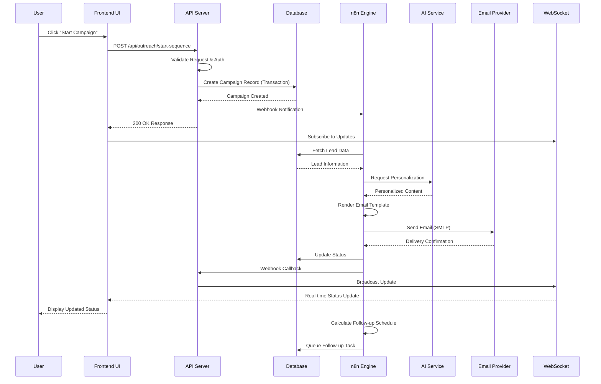

#### Email Sequence Execution Flow

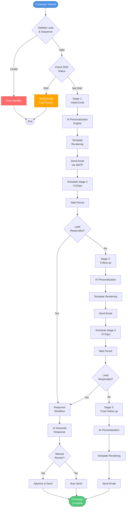

**Campaign Initiation Workflow Steps**:

1. **User Interaction**: User triggers campaign initiation via UI component
2. **API Request**: HTTP POST to `/api/outreach/start-sequence` endpoint
3. **Validation Layer**: Request validation against schema, authentication check, authorization verification
4. **Database Transaction**: Campaign record creation with ACID transaction guarantees
5. **Event Emission**: Webhook notification dispatched to automation engine
6. **Workflow Orchestration**: n8n workflow receives event and initiates processing pipeline
7. **Personalization Algorithm**: AI model processes lead data and generates personalized content
8. **Email Rendering**: Template engine applies personalization variables
9. **Delivery Queue**: Email queued for delivery with priority and retry logic
10. **SMTP Transmission**: Email sent via configured email service provider
11. **Status Synchronization**: Database updated with delivery status via webhook callback
12. **Real-time UI Update**: Frontend receives update via WebSocket subscription
13. **Follow-up Scheduling**: Temporal scheduling algorithm calculates next action timestamp
14. **Queue Management**: Follow-up task enqueued in distributed task queue

**Performance Characteristics**:
- **Latency**: End-to-end campaign initiation < 2 seconds
- **Throughput**: Supports concurrent campaign processing for multiple users
- **Scalability**: Horizontal scaling capability through stateless architecture
- **Reliability**: 99.9% uptime SLA with automated failover mechanisms

---

## Setup & Installation

### Prerequisites

Before you begin, you'll need:

- A computer with internet connection
- A web browser (Chrome, Firefox, Safari, or Edge)
- Access credentials (provided by your administrator)
- Supabase account (for database - usually set up by admin)

### Initial Setup (For System Administrators)

**Step 1: Database Infrastructure Setup**

1. **Supabase Project Initialization**: Create account and project instance at supabase.com
2. **Schema Deployment**: Execute database migration scripts (SQL schema files) to initialize table structures, indexes, and constraints
3. **Row-Level Security Configuration**: Deploy RLS policies for multi-tenant data isolation and access control
4. **Authentication Provider Configuration**: Configure Supabase Auth with email/password provider and session management
5. **Database Extensions**: Enable required PostgreSQL extensions (uuid-ossp, pgcrypto) for UUID generation and encryption

**Step 2: Environment Variable Configuration**

1. **Create Environment File**: Initialize `.env.local` in frontend directory
2. **Supabase Connection Parameters**:
   ```
   NEXT_PUBLIC_SUPABASE_URL=https://[project-id].supabase.co
   NEXT_PUBLIC_SUPABASE_ANON_KEY=[anon-public-key]
   SUPABASE_SERVICE_ROLE_KEY=[service-role-key] (server-side only)
   ```
3. **Automation Integration URLs**: Configure webhook endpoints for n8n workflow engine:
   ```
   NEXT_PUBLIC_N8N_WEBHOOK_START_SEQUENCE=[webhook-url]
   NEXT_PUBLIC_N8N_WEBHOOK_UPDATE_WARMUP_SCHEDULE=[webhook-url]
   ```
4. **Application Configuration**: Set application URL and deployment environment variables

**Step 3: Dependency Installation & Build Process**

```bash
cd frontend
npm install  # Installs all package dependencies from package.json
npm run build  # Production build with optimization (optional for dev)
```

**Dependency Management**:
- Node.js runtime (v18+ required)
- Package manager: npm or yarn
- Build toolchain: Next.js with TypeScript compilation

**Step 4: Application Runtime Initialization**

```bash
npm run dev  # Starts Next.js development server with hot-reload
```

**Runtime Configuration**:
- **Development Server**: Available at `http://localhost:3000` (configurable port)
- **Hot Module Replacement**: Enabled for rapid development iteration
- **API Routes**: Server-side endpoints accessible at `/api/*` paths
- **Static Asset Serving**: Public directory served at root path

### First-Time User Setup

**Step 1: Log In**

1. Navigate to the login page
2. Enter your email and password
3. Click "Sign In"

**Step 2: Complete Your Profile**

1. Go to Profile page
2. Add your full name
3. Upload a profile picture (optional)
4. Set your preferences

**Step 3: Explore the Dashboard**

1. Familiarize yourself with the layout
2. Check out each section
3. Review the sample data (if any)

**Step 4: Create Your First Sequence**

1. Go to Pipeline page
2. Create a simple 2-step sequence
3. Test it with one lead
4. Review the results

---

## Best Practices

### Email Outreach Optimization

✅ **Best Practices**:
- **Template Personalization**: Leverage AI personalization engine with comprehensive variable mapping for maximum relevance
- **Content Optimization**: Maintain concise messaging with clear value propositions and single, focused call-to-action
- **A/B Testing Methodology**: Deploy sequences to small test cohorts before full-scale rollout to validate effectiveness
- **Performance Monitoring**: Track engagement metrics (open rates, CTR, response rates) and iterate based on data insights
- **Deliverability Compliance**: Adhere to domain warmup schedules and volume limits to maintain sender reputation

❌ **Anti-Patterns to Avoid**:
- **Volume Violations**: Exceeding configured sending limits risks domain reputation and deliverability degradation
- **Spam Trigger Words**: Avoid language patterns that trigger spam filters (excessive capitalization, misleading subject lines)
- **Compliance Violations**: Never bypass DNC enforcement mechanisms or ignore unsubscribe requests
- **Unvalidated Automation**: Always review AI-generated responses before sending to ensure quality and appropriateness

### Lead Data Management & Quality Assurance

✅ **Data Integrity Best Practices**:
- **Data Freshness**: Maintain current lead information through regular data validation and update workflows
- **Interaction Documentation**: Document all touchpoints and conversations in lead notes for complete context preservation
- **Lifecycle State Management**: Update lead status according to state machine transitions to maintain accurate pipeline visibility
- **Taxonomy Utilization**: Leverage tagging and categorization systems for advanced segmentation and filtering
- **Deduplication Processes**: Implement regular data cleansing routines to identify and merge duplicate entries

❌ **Data Quality Anti-Patterns**:
- **Incomplete Data Sets**: Missing critical fields (email, name) prevents automation workflows from executing
- **Stale Status Information**: Outdated status values create inaccurate reporting and missed opportunities
- **Response Neglect**: Failing to process lead responses breaks engagement workflows and damages relationships
- **Data Model Violations**: Incorrectly categorizing or mixing data types (personal vs. business) corrupts analytics and segmentation

### Follow-up Management

✅ **Do**:
- Respond to leads within 24 hours
- Review AI-generated responses
- Personalize responses when needed
- Track conversation history
- Set realistic follow-up schedules

❌ **Don't**:
- Send generic responses
- Ignore lead questions
- Follow up too aggressively
- Forget to update lead status

### Compliance

✅ **Do**:
- Respect DNC requests immediately
- Keep DNC reasons documented
- Review DNC list regularly
- Train team on compliance
- Monitor email deliverability

❌ **Don't**:
- Contact DNC entries
- Ignore unsubscribe requests
- Send emails without permission
- Violate privacy regulations

---

## Troubleshooting Guide

### Common Issues and Solutions

**Issue: "I Can't Log In"**

**Solutions**:
- Check your email and password
- Make sure Caps Lock is off
- Clear browser cache
- Try a different browser
- Contact administrator to reset password

**Issue: "Emails Aren't Sending"**

**Solutions**:
- Check if lead has valid email address
- Verify lead is not on DNC list
- Check campaign status (should be "Active")
- Verify email sequence is active
- Check automation system status
- Review email deliverability settings

**Issue: "I Don't See My Leads"**

**Solutions**:
- Check search filters
- Verify you're on the correct page
- Clear browser cache
- Check if leads have required information
- Verify database connection

**Issue: "AI Responses Don't Make Sense"**

**Solutions**:
- Review AI configuration settings
- Check conversation history is complete
- Adjust personalization strategy
- Manually edit responses before sending
- Update AI prompt templates

**Issue: "System is Slow"**

**Solutions**:
- Check internet connection
- Close unnecessary browser tabs
- Clear browser cache
- Try a different browser
- Contact support if issue persists

**Issue: "I Can't Import CSV File"**

**Solutions**:
- Check file format (must be .csv)
- Verify column headers match expected format
- Check file size (should be under 10MB)
- Ensure data is properly formatted
- Review error messages for specific issues

---

## Frequently Asked Questions

### General Questions

**Q: Do I need to install anything on my computer?**
A: No! This is a web-based system. You just need a web browser and internet connection.

**Q: Can I use this on my phone?**
A: Yes! The system works on phones, tablets, and computers. Just open it in your mobile browser.

**Q: Is my data safe?**
A: Yes. All data is encrypted and stored securely. Regular backups are performed automatically.

**Q: How many leads can I manage?**
A: The system can handle thousands of leads. There's no practical limit for most businesses.

**Q: Can multiple people use this at the same time?**
A: Yes! Multiple users can work simultaneously. Each user has their own login.

### Email Outreach Questions

**Q: How many emails can I send per day?**
A: This depends on your email deliverability settings and domain warmup status. The system will guide you.

**Q: Will my emails go to spam?**
A: The system includes deliverability features to minimize spam. Domain warmup and monitoring help ensure good deliverability.

**Q: Can I customize email templates?**
A: Yes! You can create unlimited email templates and customize them for each sequence.

**Q: What happens if a lead replies?**
A: The system automatically detects replies, updates the lead status, and can generate AI responses for you to review.

**Q: Can I pause a campaign?**
A: Yes! You can pause, resume, or cancel campaigns at any time from the Follow-ups page.

### Lead Management Questions

**Q: Can I import leads from Excel?**
A: Yes! Export your Excel file as CSV, then import it into the system.

**Q: How do I remove duplicate leads?**
A: Use the search and filter features to find duplicates, then delete or merge them manually.

**Q: Can I export my leads?**
A: Yes! You can export leads, companies, and contacts to CSV files.

**Q: What information is required for a lead?**
A: At minimum, you need a name and email address. More information helps with personalization.

### DNC Questions

**Q: How do I mark someone as DNC?**
A: Go to Companies or Contacts page, find the entry, click the menu, and select "Mark as DNC."

**Q: Can I remove someone from DNC?**
A: Yes! Go to the DNC page, find the entry, and click the remove button.

**Q: Will the system prevent emails to DNC entries?**
A: Yes! The system automatically blocks emails to any entry marked as DNC.

**Q: Can I bulk upload DNC entries?**
A: Yes! Use the bulk upload feature on the DNC page with a CSV file.

### Technical Questions

**Q: What browsers are supported?**
A: Chrome, Firefox, Safari, and Edge (latest versions recommended).

**Q: Do I need special software?**
A: No, just a modern web browser.

**Q: Is there a mobile app?**
A: Not yet, but the web version works great on mobile devices.

**Q: Can I integrate with other tools?**
A: Yes! The system supports integrations via webhooks and API (contact administrator for details).

**Q: How often is data backed up?**
A: Automatic backups occur daily. Your data is always safe.

---

## Support & Resources

### Getting Help

**For Technical Issues**:
- Check this documentation first
- Review the Troubleshooting Guide
- Contact your system administrator
- Check system status page (if available)

**For Feature Questions**:
- Review the Feature Walkthrough section
- Check Best Practices
- Contact your team lead
- Request training session

### Training Resources

**Recommended Learning Path**:

1. **Week 1**: Learn the basics
   - Dashboard navigation
   - Adding and managing leads
   - Understanding lead statuses

2. **Week 2**: Master outreach
   - Creating email sequences
   - Starting campaigns
   - Monitoring responses

3. **Week 3**: Advanced features
   - AI personalization
   - Follow-up management
   - Analytics and reporting

4. **Week 4**: Optimization
   - Refining sequences
   - Improving response rates
   - Best practices implementation

### Additional Resources

- **User Guide**: See CRM_USER_GUIDE.md
- **Setup Documentation**: See docs/SUPABASE_SETUP.md
- **API Documentation**: Contact administrator
- **Video Tutorials**: (If available)

### Contact Information

**System Administrator**: [Your Admin Contact]  
**Support Email**: [Support Email]  
**Emergency Contact**: [Emergency Contact]

---

## Appendix

### System Component Diagram

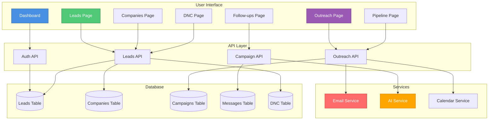

### Data Model Entity Relationship

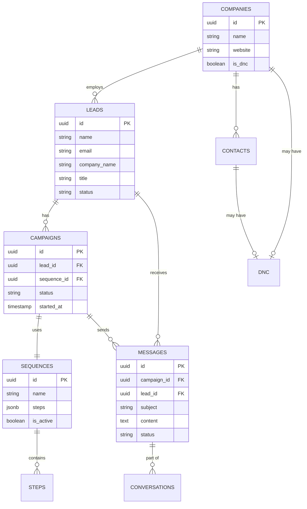

### Glossary of Terms

**Campaign**: An orchestrated email outreach initiative targeting one or more leads, managed through automated workflow execution

**Sequence**: A multi-stage email workflow template consisting of pre-configured email stages with temporal delays and conditional logic

**Lead**: A prospect entity in the CRM database representing a potential customer, containing demographic and behavioral data

**DNC (Do Not Contact)**: A compliance flag in the data model that prevents email delivery through automated enforcement algorithms

**Pipeline**: The sales funnel representing the progression from initial contact through qualification stages to deal closure

**ICP Score (Ideal Customer Profile Score)**: Algorithmic scoring metric that quantifies how well a lead matches your target customer profile based on weighted attribute analysis

**Domain Warmup**: A gradual volume escalation algorithm designed to build sender reputation and improve email deliverability rates

**Deliverability**: The probability metric measuring email inbox placement success, influenced by sender reputation, content quality, and technical configuration

**AI Personalization**: Machine learning-driven content customization process that dynamically adapts email messaging based on lead profile data and behavioral patterns

**Follow-up Queue**: A priority-ordered data structure containing scheduled follow-up tasks awaiting execution based on temporal scheduling algorithms

**Workflow Orchestration**: The automated coordination of multi-step processes, managing state transitions and task dependencies

**State Machine**: A computational model tracking lead progression through defined states (New → Contacted → Qualified → Converted)

**Webhook**: An HTTP callback mechanism enabling real-time event notification between distributed systems

**Temporal Scheduling**: Algorithm-based time management for task execution, calculating optimal timing based on configurable parameters

**Row-Level Security (RLS)**: Database-level access control mechanism ensuring users can only access data rows they're authorized to view

---

### Visual Reference Guide

#### Icon Legend

- 🟡 **Not Started**: Campaign ready but not yet initiated
- 🔵 **Waiting**: Email sent, awaiting response
- 🟢 **Responded**: Lead has engaged with email
- 🟣 **Booked**: Meeting scheduled, high-value interaction
- ⚠️ **Warning**: Attention required
- ✅ **Success**: Operation completed successfully
- ❌ **Error**: Operation failed or blocked
- 🔒 **Locked**: Restricted access or DNC status

#### Color Coding System

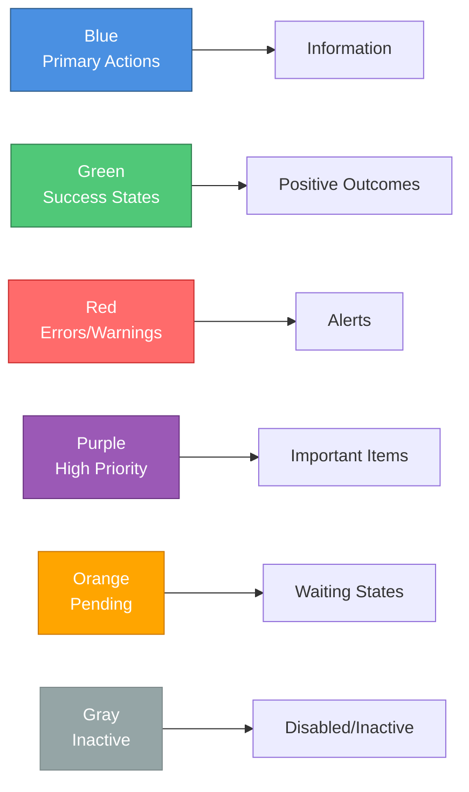

---

### Keyboard Shortcuts

- **Ctrl/Cmd + K**: Quick search
- **Ctrl/Cmd + S**: Save (in forms)
- **Esc**: Close dialogs
- **Tab**: Navigate between fields

---

### System Requirements

**Minimum Requirements**:
- Internet connection (broadband recommended)
- Modern web browser (Chrome, Firefox, Safari, Edge)
- Screen resolution: 1280x720 or higher

**Recommended**:
- High-speed internet connection
- Latest browser version
- Screen resolution: 1920x1080 or higher
- Multiple monitors (for productivity)

---

## Document Information

**Document Version**: 1.0  
**Last Updated**: December 2024  
**Next Review**: March 2025  
**Prepared By**: Development Team  
**Approved By**: [Approver Name]

---

**© 2024 Lincoln Waste Solutions. All Rights Reserved.**

*This document contains proprietary and confidential information. Distribution is restricted to authorized personnel only.*

---

## End of Document

For questions or updates to this documentation, please contact your system administrator.
